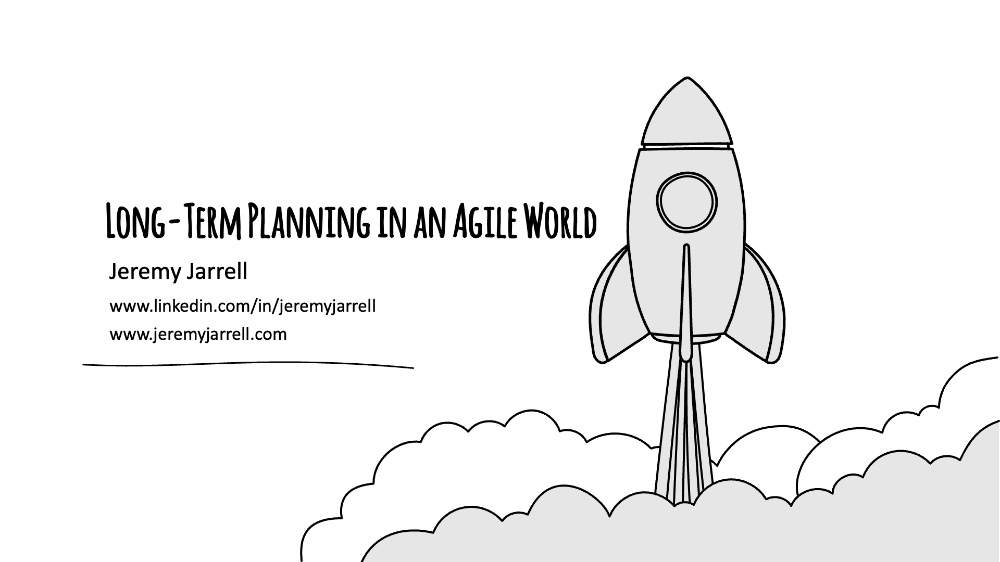

This session was originally delivered at Code Mash 2024.

## Resources
[Vision Statement Template (ProdPad)](https://www.prodpad.com/blog/product-vision-template/)

[Making Sense of Planning in an Agile World (ProductPlan)](https://www.productplan.com/blog/agile-planning-onion/)

[What, When, How: The 3 Levels of Strategic Planning (JeremyJarrell.com)](https://www.jeremyjarrell.com/jeremy-jarrell/strategic-agile-planning)

[Product Management: Strategy and Vision (Pluralsight)](https://app.pluralsight.com/library/courses/product-management-strategy-vision/table-of-contents)
